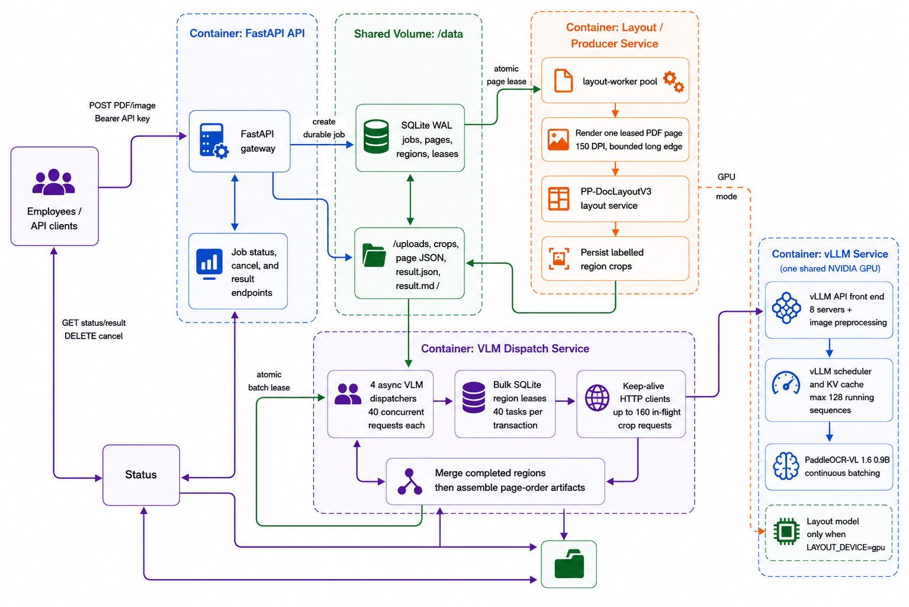

# PaddleOCR-VL API

<p align="left">
  <a href="https://github.com/PaddlePaddle/PaddleOCR">
    
  </a>
  <a href="https://docs.vllm.ai/">
    
  </a>
  <a href="https://fastapi.tiangolo.com/">
    
  </a>
  <a href="https://www.docker.com/">
    
  </a>
  <a href="https://developer.nvidia.com/cuda-toolkit">
    
  </a>
  <a href="https://www.python.org/">
    
  </a>
</p>



This repository turns PaddleOCR-VL into a self-hosted, GPU-accelerated document-processing API. It processes images and multi-page PDFs through authenticated FastAPI endpoints and returns structured JSON, clean Markdown, or both while preserving headings, paragraphs, lists, formulas, and tables.

Designed for private OCR and RAG ingestion, the system includes validation,
configurable limits, automated model setup, authentication, health checks, and
lightweight tests.

Docker Compose runs FastAPI, a GPU layout service, direct PaddleOCR vLLM
inference, and fixed worker pools. The layout model and vLLM share one GPU.

See the API reference for authentication, exact parameters, response formats, examples, limits, and error codes.

## Requirements

- A Linux host with Docker Engine and Docker Compose v2.
- An NVIDIA GPU, supported NVIDIA driver, and NVIDIA Container Toolkit.
- Internet access for the first image and model download from Hugging Face 
- A firewall or reverse proxy policy that exposes only `APP_PORT`; layout and vLLM stay on the internal Compose network.(`Optional`)
- It admits **20** active image/PDF jobs by default; adjust `MAX_JOBS` in `.env`.


### Verify GPU access

```bash
nvidia-smi
docker run --rm --gpus all nvidia/cuda:12.4.1-base-ubuntu22.04 nvidia-smi
```

## Deploy

1. Clone the repository and enter it.

   ```bash
   git clone <repository-url> paddleocr-vl
   cd paddleocr-vl
   ```

2. Create the deployment environment file and set a strong API key. Review
   `APP_PORT` and `GPU_DEVICE_ID` before continuing.

   ```bash
   cp .env.example .env
   openssl rand -hex 32
   ```

   Put the generated value in `PUBLIC_API_KEY` in `.env`.

3. Validate the resolved Compose configuration. Fix missing variables or YAML
   errors before starting containers.

   ```bash
   docker compose config --quiet
   ```

4. Build the application image and start the complete stack. The initial run
   downloads container images and the layout model.

   ```bash
   docker compose up --build -d
   docker compose logs -f model-setup
   ```

   Stop following logs after `model-setup` exits successfully.

5. Wait for `paddleocr-vlm-server`, `layout`, and `api` to become healthy.

   ```bash
   docker compose ps
   ```

6. Verify the published gateway. Replace `localhost` with the server hostname
   or IP when testing from another machine.

   ```bash
   curl --fail-with-body http://localhost:${APP_PORT:-8080}/health
   ```

7. Submit a PDF using the bearer token. The API returns `202 Accepted`; poll
   the returned `status_url` until the job is complete.

   ```bash
   curl --fail-with-body -X POST \
     "http://localhost:${APP_PORT:-8080}/parse/pdf?output_format=both" \
     -H "Authorization: Bearer <PUBLIC_API_KEY>" \
     -F file=@document.pdf
   ```

The `model-step` download and pins the `PP-DocLayoutV3` model for the first time and uses it for all runs. The first run make take a while depending on the internet connectivity. 

## Use the API

Install the Python client dependency:

```bash
python -m pip install requests python-dotenv
```

Set `OCR_BASE_URL` to the deployed server and `OCR_API_KEY` to the configured
`PUBLIC_API_KEY`. This example submits a PDF, waits for completion, then saves
the JSON and Markdown artifacts.

```python
import os
from pathlib import Path
import time
from dotenv import load_dotenv
import requests

load_dotenv()

base_url = os.getenv("OCR_BASE_URL", "http://localhost:8080").rstrip("/")
api_key = os.getenv("OCR_API_KEY")

if not api_key:
    raise ValueError("OCR_API_KEY not found in .env")

headers = {"Authorization": f"Bearer {api_key}", "accept": "application/json"}

input_file = Path("task.pdf")

# Submit job (no read timeout limit)
with input_file.open("rb") as document:
    response = requests.post(
        f"{base_url}/parse/pdf",
        params={"output_format": "markdown"},
        headers=headers,
        files={"file": (input_file.name, document, "application/pdf")},
        timeout=(10, None),  # 🔥 important fix
    )

response.raise_for_status()
job = response.json()

print(f"Job submitted: {job['job_id']}")

# Poll for completion
while True:
    response = requests.get(
        f"{base_url}{job['status_url']}", headers=headers, timeout=30
    )
    response.raise_for_status()
    status = response.json()

    if status["status"] == "completed":
        break
    if status["status"] in {"failed", "cancelled"}:
        raise RuntimeError(status)

    time.sleep(2)

# Download markdown result
markdown_url = status["result_urls"]["markdown"]

response = requests.get(f"{base_url}{markdown_url}", headers=headers, timeout=60)
response.raise_for_status()

# Save as .md with same name
output_file = input_file.with_suffix(".md")
output_file.write_text(response.text, encoding="utf-8")

print(f"Saved Markdown to: {output_file}")
```

`POST /parse/pdf` and `POST /parse/image` both return `202 Accepted`; they
queue work and do not contain the completed document. Submit an image with the
same client flow by changing the path to `/parse/image`, using an image file and
media type, and keeping the same `output_format` parameter.

See [docs/API.md](docs/API.md) for image parsing,
cancellation, errors, and the full API contract.

## Performance tuning

The current config was tested on a 24 GB VRAM based NVIDIA GPU with 16GB ram and 16 Core CPU. Make sure to adjust the config based on your hardware.

### Current tuning controls

| Variable | Configure in | Controls in the current design |
|---|---|---|
| `GPU_DEVICE_ID` | `.env` | GPU assigned to both the fixed PaddleX layout service and vLLM. |
| `MAX_JOBS` | `.env` | Global admission limit for active image/PDF jobs; excess submissions receive `429`. |
| `MAX_PAGES_PER_JOB` | `.env` | Maximum pages from one PDF that may be in the page pipeline at once; preserves fairness between jobs. |
| `MAX_REGIONS_PER_PAGE` | `.env` | Maximum layout crops generated from one page; bounds disk use and region-queue fan-out. |
| `LAYOUT_WORKER_REPLICAS` | `.env` | Number of page render/layout producers. They feed the region queue but do not directly increase vLLM concurrency. |
| `VLM_WORKER_REPLICAS` | `.env` | Number of async region-dispatcher processes. |
| `VLM_DISPATCH_CONCURRENCY` | `.env` | Maximum simultaneous vLLM HTTP requests per dispatcher. Combined outbound capacity is replicas × this value. |
| `VLM_CLAIM_BATCH_SIZE` | `.env` | Number of region leases claimed in one SQLite transaction; set at least as high as dispatcher concurrency. |
| `LEASE_SECONDS` | `.env` | Crash-recovery delay before a page or region lease can be reclaimed; reliability, not GPU throughput. |
| `MAX_RETRIES` | `.env` | Transient page/region inference retry budget; reliability, not concurrency. |
| `gpu-memory-utilization` | `deploy/vllm_config.yaml` | VRAM reserved by vLLM for weights, activations, and KV cache; must leave headroom for GPU layout. |
| `max-num-seqs` | `deploy/vllm_config.yaml` | Maximum sequences vLLM may admit to its running scheduler batch. |
| `max-num-batched-tokens` | `deploy/vllm_config.yaml` | Maximum token prefill work per vLLM scheduler step; increasing it can improve batching when VRAM permits. |
| `max-model-len` | `deploy/vllm_config.yaml` | Per-request context ceiling; normally leave at `8192`, as it is not a primary throughput control. |
| `mm-processor-cache-gb` | `deploy/vllm_config.yaml` | GPU/host cache budget for multimodal preprocessing; `0` avoids retaining normally unique OCR crops. |

The layout service is intentionally fixed at one GPU model instance. Raising
`LAYOUT_WORKER_REPLICAS` only increases the number of producers waiting to use
that service; it does not create additional layout-model copies.

### Estimate concurrent requests sent to vLLM

Each `vlm-worker` replica is one async dispatcher. Its maximum number of
simultaneous outbound HTTP requests is `VLM_DISPATCH_CONCURRENCY`:

```text
maximum VLM requests in flight
  = VLM_WORKER_REPLICAS × VLM_DISPATCH_CONCURRENCY
```

With the default settings, `4 × 32`, the worker pool can send up to **128**
region requests to vLLM at once. Set `VLM_CLAIM_BATCH_SIZE` at least as high as
`VLM_DISPATCH_CONCURRENCY` so a dispatcher can fill its slots in one SQLite
lease operation.

| VLM worker replicas | Requests per dispatcher | Maximum outbound requests |
|---:|---:|---:|
| `4` | `32` | `128` |
| `6` | `32` | `192` |
| `8` | `40` | `320` |

This is a producer limit, not a guarantee that the GPU runs that many requests.
The rough engine limit is:

```text
vLLM running requests
  ≈ min(outbound requests, max-num-seqs, requests that fit in available VRAM)
```

`LAYOUT_WORKER_REPLICAS` does not multiply vLLM requests. It controls how fast pages are rendered and cropped into region tasks. If vLLM `waiting` is near zero, layout production—not more VLM dispatchers—is the likely limit.

Keep one layout service, start with two layout workers plus four VLM dispatchers at 32 requests each. The layout model and vLLM share the GPU, so use vLLM memory headroom before raising dispatcher concurrency.

### Tune GPU layout production

GPU layout is fixed at one service to avoid loading another PP-DocLayoutV3
copy onto the GPU. `LAYOUT_WORKER_REPLICAS` is the only layout setting to tune;
it controls how many pages can render and wait to call that service.

| Load-test observation | `LAYOUT_WORKER_REPLICAS` action |
|---|---|
| vLLM `waiting` is near zero and GPU use is low | Raise one step: `2 → 3 → 4`. Retest after each step. |
| vLLM has a sustained waiting queue | Keep it at `2`; layout is already supplying enough work. |
| Layout service errors, higher page latency, or GPU memory pressure | Return to `2`; do not add layout replicas. |

Change the value in `.env` and recreate only the producer pool:

```bash
docker compose up -d --build --force-recreate layout-worker
```

If VLM workers are idle, add layout capacity. If the stored region queue grows
continually, the GPU is full and the fixed pool is correctly applying
backpressure. vLLM batches independent region requests across all documents.

Docker CPU percentages are per core: on a 32-core host, `3200%` is the whole machine and `100%` is one core.

vLLM limits are in `deploy/vllm_config.yaml`. Start with the profile matching the GPU arrangement, then change one value and repeat the same load test.


### Tune vLLM

| Hardware VRAM | GPU memory utilization | Max sequences | Batched tokens | Notes |
|---|---:|---:|---:|---|
| 16 GB GPU shared with GPU layout | `0.40` | `32` | `16384` | Conservative starting point; leave memory for layout. |
| 24 GB GPU shared with GPU layout | `0.55` | `64` | `32768` | Recommended starting point for this deployment. |
| 24 GB GPU, vLLM only | `0.70` | `128` | `49152` | Use only when layout runs on CPU or another GPU. |
| 48 GB+ GPU, vLLM only | `0.75` | `128` | `65536` | Raise further only after measuring throughput and VRAM. |


Use the scheduler gauges and GPU monitoring to choose the next change:

| Observation during a steady load test | Change |
|---|---|
| `waiting` stays above zero; GPU is below 70%; VRAM has headroom | Raise `max-num-batched-tokens` one step: `16384 → 32768 → 49152`. |
| `waiting` stays above zero; GPU is below 70%; batched tokens are already at 49152 | Raise `max-num-seqs` one step: `32 → 64 → 96 → 128`. |
| GPU is below 70%; waiting is near zero | Do not raise vLLM limits; increase layout/region production or incoming load. |
| GPU is above 85%; waiting grows; latency rises | The GPU is saturated; do not add VLM workers. |
| CUDA OOM, layout failures, or little free VRAM | Lower `gpu-memory-utilization` by `0.05`, then lower sequences if needed. |


After editing the file, recreate vLLM and wait for it to become healthy:

```bash
docker compose up -d --force-recreate paddleocr-vlm-server
docker compose logs --tail=100 paddleocr-vlm-server
```

### Observe vLLM running and waiting requests

From the project directory, print the scheduler gauges:

```bash
docker compose exec -T paddleocr-vlm-server \
  sh -c 'curl -fsS http://localhost:8118/metrics | grep -E "vllm:num_requests_(running|waiting)"'
```

Refresh them once per second during a load test:

```bash
watch -n 1 'docker compose exec -T paddleocr-vlm-server sh -c "curl -fsS http://localhost:8118/metrics | grep -E '\''vllm:num_requests_(running|waiting)'\''"'
```

`running` is work admitted to vLLM; `waiting` is GPU backlog. A sustained
waiting value means the GPU is saturated, while both values near zero means
the layout/region producers are not supplying vLLM.


## Operations

### Apply settings and restart services


1. Stop and resume containers without deleting them:

    ```bash
    docker compose stop
    docker compose up -d
    ```

2. Restart an unchanged service after a transient failure:

    ```bash
    docker compose restart api
    ```

`restart` does not apply changed environment variables, images, mounted
configuration, or Compose settings; use the `up --force-recreate` commands below for those changes.

3. Stop and remove containers and the Compose network while preserving jobs, models, and caches in named volumes:

    ```bash
    docker compose down
    ```

Do not add `--volumes` unless all jobs, results, downloaded models, and caches may be deleted.

4. Apply changes according to what was edited:

    ```bash
    # Layout service configuration
    docker compose up -d --force-recreate layout

    # vLLM settings in deploy/vllm_config.yaml
    docker compose up -d --force-recreate paddleocr-vlm-server

    # API, layout-worker, or vlm-worker Python
    docker compose up -d --build api layout-worker vlm-worker

    # .env or compose.yaml changes across the stack
    docker compose up -d --force-recreate
    ```

5. After changing fixed pool values in `.env`, recreate the pools with:

    ```bash
    docker compose up -d --force-recreate layout layout-worker vlm-worker
    ```

### Troubleshooting and debugging

Inspect status and logs:

```bash
docker compose ps
docker compose logs --tail=200 paddleocr-vlm-server
docker compose logs -f api layout layout-worker vlm-worker paddleocr-vlm-server
docker compose top
docker compose events
```

Validate the resolved Compose configuration before restarting:

```bash
docker compose config --quiet
docker compose config
docker compose port api 8080
```

Check API and internal service readiness:

```bash
curl --fail-with-body http://localhost:${APP_PORT:-8080}/health
docker compose exec api python -c \
  "import urllib.request; urllib.request.urlopen('http://layout:8090', timeout=5).close(); print('ready')"
```

Monitor resource pressure during a load test:

```bash
docker stats
nvidia-smi
nvidia-smi dmon -s pucm
```

#### Watch SQLite queue state

Run this from the project directory to refresh job, page, and region status
counts every two seconds. Press `Ctrl+C` to stop it.

```bash
while :; do
  clear
  docker compose exec -T api python -c '
import sqlite3

db = sqlite3.connect("/data/jobs.db")
for table in ("jobs", "pages", "regions"):
    print(f"{table}:", dict(db.execute(f"SELECT status, COUNT(*) FROM {table} GROUP BY status")))
'
  sleep 2
done
```

Interpret the result as follows: `jobs` shows client-visible document lifecycle,
`pages` shows layout work, and `regions` shows the crop requests waiting for or
running through vLLM. Compare `regions` with vLLM's `running` and `waiting`
gauges: sustained vLLM waiting means the engine is saturated; pending regions
with no vLLM waiting means work is not reaching the engine fast enough.

When a service is unhealthy or exits, start with its first startup error rather
than the final dependency failure:

```bash
docker compose ps --all
docker compose logs --tail=300 model-setup
docker compose logs --tail=300 paddleocr-vlm-server
docker compose logs --tail=300 api layout layout-worker vlm-worker
```

For an interactive restart that keeps the failing service attached to the
terminal:

```bash
docker compose stop layout
docker compose up layout
```

Data lives in the local `app-data` volume and remains there until an operator removes it; do not place the SQLite database on NFS.

The region queue is durable in SQLite, so queued regions resume after either fixed worker pool restarts.


## Development

```bash
uv sync
uv run pytest -q
docker compose config --quiet
```
